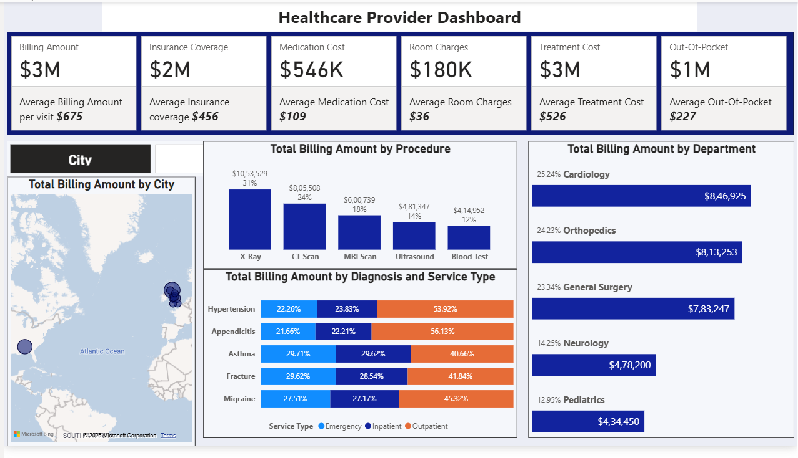

# 🏥 Healthcare Provider Dashboard | Power BI

## Overview
An interactive Power BI dashboard built to analyze healthcare provider performance, billing, and treatment costs. The dashboard enables users to monitor key financial KPIs and explore trends across departments, procedures, diagnoses, and locations.

> Replace the image path above with your uploaded dashboard screenshot.

---

## Key Features
- 📊 Executive KPI cards for billing, insurance, treatment, medication, and out-of-pocket costs
- 🩺 Department-wise billing analysis
- 🏥 Procedure-wise revenue breakdown
- 🌍 Geographic visualization of billing by city
- 📈 Diagnosis and service type comparison
- 🎯 Interactive filtering for better data exploration

---

## Dashboard Metrics
- Total Billing Amount
- Insurance Coverage
- Treatment Cost
- Medication Cost
- Room Charges
- Out-of-Pocket Expenses
- Average Cost per Visit
---

## Insights & Recommendations

### 🫀 Cardiology generated the highest billing.
**Why?** High-cost procedures and specialized treatments contribute to higher revenue.  
**Recommendation:** Optimize resource allocation and monitor operational efficiency.

### 🩻 X-Ray accounted for the highest procedure revenue.
**Why?** High patient volume and frequent diagnostic usage.  
**Recommendation:** Ensure equipment availability and reduce patient wait times.

### 🏥 Outpatient services dominated across most diagnoses.
**Why?** Many conditions can be effectively treated without hospital admission.  
**Recommendation:** Expand outpatient services to improve patient throughput and reduce costs.

### 🌍 Billing varied across cities.
**Why?** Differences in patient demand and healthcare utilization.  
**Recommendation:** Use regional trends to support staffing and resource planning.

